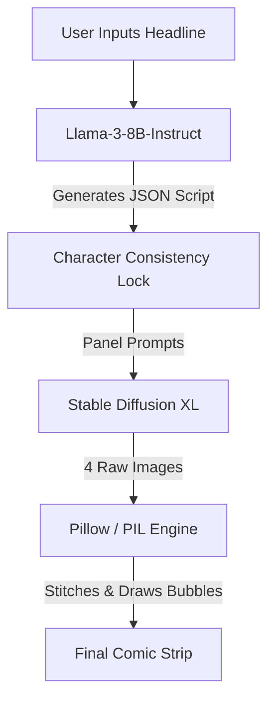

# AI Comic Strip Generator 📰🎨

A serverless, fully free AI application that transforms news headlines into beautiful 4-panel comic strips. Built for a 12-hour hackathon, this app uses Hugging Face's Free Serverless Inference API to combine Large Language Models and text-to-image diffusion into a seamless Streamlit experience.

## 📸 Gallery
*(Drag and drop your best generated comic image here on GitHub to replace this text!)*

## ✨ Features
- **Zero Paid APIs**: Runs 100% on Hugging Face's free tier.
- **Llama 3 Scriptwriting**: Uses `meta-llama/Meta-Llama-3-8B-Instruct` to dynamically generate a 4-panel JSON comic script from any headline.
- **Character Consistency Lock**: A specialized prompt engineering schema forces the LLM to lock onto a `main_character_profile` across all 4 image prompts, solving the GenAI "Character Amnesia" problem.
- **Custom Headline Engine**: Choose from pre-loaded CSV news or type any custom headline live.
- **Stable Diffusion Art**: Generates high-quality, editorial-style comic panels using `stabilityai/stable-diffusion-xl-base-1.0`.
- **Dynamic Layout Engine**: Uses Pillow (PIL) to automatically stitch images, calculate text wrapping, and overlay classic comic book speech bubbles with tails.
- **Robust Error Handling**: Includes automatic API retries and hardcoded fallback templates so the demo never crashes.

## 🛠️ Technology Stack
- **Frontend**: Streamlit
- **AI Models**: Llama-3-8B-Instruct (Text), SDXL 1.0 (Image)
- **API Client**: `huggingface_hub`
- **Image Processing**: Pillow (PIL)
- **Data**: Pandas (for reading local news CSVs)

## 🚀 Setup & Installation

### 1. Prerequisites
- Python 3.9+
- **Hugging Face Token**: Go to your [HF Tokens Page](https://huggingface.co/settings/tokens) and create a new token. Ensure the token type is set to **"Write"** (or check "Make calls to the Serverless Inference API").
- **Llama 3 Access**: Because Llama 3 is a gated model, you **MUST** go to [Meta-Llama-3-8B-Instruct](https://huggingface.co/meta-llama/Meta-Llama-3-8B-Instruct) while logged in and click "Agree to Access" to accept the Terms & Conditions before running the app.

### 2. Install Dependencies
```bash
pip install streamlit requests huggingface_hub Pillow pandas
```

### 3. Add API Key
Create a `.streamlit/secrets.toml` file in the root directory and add your token:
```toml
hf_api_token = "hf_YOUR_TOKEN_HERE"
```

### 4. Run the App
```bash
python -m streamlit run app.py
```
Then open `http://localhost:8501` in your browser!

## 💡 How it Works
1. **Selection**: User either picks a curated headline from `news_sample.csv` or types a **Custom Headline**.
2. **Prompting**: The app sends a highly constrained prompt to Llama 3 to output a JSON array of 4 panels (dialogue + visual prompts).
3. **Generation**: The app calls SDXL to generate the raw images, using a strict negative prompt to maintain professional illustration quality.
4. **Compositing**: The layout engine resizes the images, draws speech bubbles based on text length, overlays the dialogue, and stitches them into a 2x2 grid.

## 🏗️ Architecture Diagram


## 🛑 Common Troubleshooting for Judges

- **App takes a long time on the first generation?** 
  This is normal! Hugging Face free-tier models go to sleep when inactive. The first time you click generate, the "Cold Start" might take 30–60 seconds while the model loads into memory. The app is programmed to wait and retry automatically. Just leave the spinner running!

- **Rate Limit (402/429 Errors)?** 
  This app relies on Hugging Face's free serverless inference quota. If you see a `402 Payment Required` or `429 Rate Limit` error, it means the token has temporarily exhausted its free credits for SDXL image generation. To fix this instantly, please generate a fresh token at [huggingface.co/settings/tokens](https://huggingface.co/settings/tokens) and update your `.streamlit/secrets.toml`.
