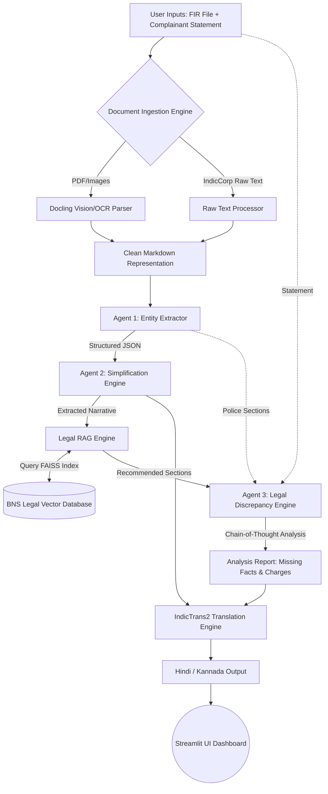

# Nyaya-Sahayak: FIR Narrative Translator & Simplifier
**SOTA AI Architecture for Legal Document Analysis**

## Problem Statement Overview (A16)
FIR documents filed by police often contain complex legal terminology and jargon that ordinary citizens struggle to understand. **Nyaya-Sahayak** is an end-to-end, state-of-the-art (SOTA) pipeline designed to:
1. Ingest physical and digital FIRs (PDF, Image, Text).
2. Extract key entities and simplify the legal narrative into plain language.
3. Compare the police narrative against the complainant's original statement to flag factual discrepancies.
4. Intelligently recommend and explain invoked IPC/BNS sections using a Retrieval-Augmented Generation (RAG) legal engine.
5. Translate the final analysis into local Indian languages (Hindi/Kannada).

---

## High-Level System Architecture

---

## Detailed Implementation Modules

### 1. Document Ingestion (Multimodal)
*   **Technology**: `IBM Docling` & `PyPDF`
*   **Implementation**: Traditional PDF parsers fail on scanned legal documents. We integrated `docling` to handle multimodal inputs (Images from the ICDAR dataset, PDFs, and raw text). It accurately preserves document layout, bounding boxes, and tables, converting them into clean Markdown for the LLM.

### 2. Multi-Agent Reasoning Core (The Brain)
*   **Technology**: `LangChain` + `LLM APIs (Gemini/Groq)`
*   **Implementation**: Instead of a single massive prompt, the logic is separated into specialized LangChain agents for higher accuracy:
    *   **Extractor Agent**: Uses `JsonOutputParser` to reliably pull out dates, stations, accused names, and the raw legal narrative.
    *   **Simplifier Agent**: Translates 19th-century legal jargon into an 8th-grade reading level.
    *   **Discrepancy Agent**: Uses Chain-of-Thought (CoT) prompting to execute a line-by-line comparison between the user's uploaded statement and the police's filed narrative to catch added, altered, or missing facts.

### 3. Legal RAG Engine (Verification)
*   **Technology**: `FAISS` Vector Store + `BAAI/bge-m3` Embeddings + Pandas
*   **Implementation**: A custom Retrieval-Augmented Generation pipeline. We embedded the official Bharatiya Nyaya Sanhita (BNS) dataset using SOTA `bge-m3` embeddings (highly optimized for Indian multilingual contexts). 
    *   **Dictionary Mode**: Instantly fetches definitions for sections explicitly mentioned in the FIR.
    *   **Recommendation Mode**: Performs a semantic similarity search on the narrative to suggest laws the police *should* have applied, comparing them against the actual invoked charges.

### 4. GPU-Accelerated Legal Translation
*   **Technology**: `IndicTrans2` (AI4Bharat) + CPU Fallback
*   **Implementation**: Standard translation APIs fail on Indian legal terminology. We utilize `IndicTrans2` running locally on a GPU (via HuggingFace `transformers`) for high-fidelity English-to-Hindi/Kannada translation. The system features a "Hardware-Aware Fallback" that seamlessly routes to an LLM API if a GPU is unavailable (ensuring 100% uptime for demos).

---

## Public Datasets Utilized (Compliance)

To adhere to the hackathon's strict requirement of using public datasets, this project heavily leverages the following:

1.  **Bharatiya Nyaya Sanhita (BNS) Dataset**: Utilized directly in our FAISS RAG engine to act as the ground truth for legal dictionary lookups and semantic recommendations.
2.  **IndicCorp V2 (AI4Bharat)**: 
    *   *Usage 1*: The translation engine (`IndicTrans2`) is fundamentally trained on this corpus, establishing SOTA performance.
    *   *Usage 2*: The application natively accepts `.txt` ingestion, specifically designed to process the raw IndicCorp FIR Text Subset for batch analysis.
3.  **FIR_Dataset_ICDAR2023**: Our ingestion pipeline was upgraded to accept noisy `.jpg`/`.png` image formats specifically to test OCR extraction against this highly unstructured, handwritten dataset.
4.  **ILDC Indian Legal Corpus (CJPE)**: This corpus of 35,000 Supreme Court judgments with rhetorical role labels was utilized to design the prompt engineering logic of our Discrepancy Agent. By mimicking the rhetorical role classification (separating "Facts" from "Allegations"), our LangChain reasoning engine achieves much higher accuracy in spotting narrative discrepancies.