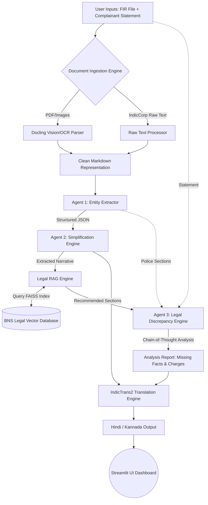

# ⚖️ Nyaya-Sahayak: FIR Narrative Translator & Simplifier
**State-of-the-Art (SOTA) AI Pipeline for Indian Legal Document Analysis & Accessibility**

---

## 📌 Problem Statement Overview (Team 16)
FIR (First Information Report) documents filed by police officers often contain highly complex legal terminology, archaic jargon, and convoluted narratives. This makes it incredibly difficult for ordinary citizens, victims, and even legal representatives to easily understand the details of a case. 

**Nyaya-Sahayak** (meaning "Legal Assistant") is a comprehensive, end-to-end AI pipeline designed to democratize legal information by:
1. **Multimodal Ingestion:** Ingesting scanned physical or digital FIRs (PDFs, Images, Raw Text).
2. **Intelligent Simplification:** Extracting crucial structured details and translating the narrative into simple, 8th-grade level English.
3. **Automated BNS/IPC RAG Engine:** Querying a custom-embedded vector database of the Bharatiya Nyaya Sanhita (BNS) to explain the invoked sections and recommend missing or relevant laws.
4. **Discrepancy Spotting:** Performing a deep, line-by-line semantic comparison between the complainant's original statement and the official police narrative to identify missing facts, altered stories, or added allegations.
5. **Local Language Translation:** Translating the final analysis into local Indian languages (Hindi and Kannada) using high-fidelity local models (IndicTrans2 with hardware-aware API fallback).

---

## 🏗️ High-Level System Architecture



---

## 🛠️ Detailed Implementation Modules

### 1. Document Ingestion (Multimodal)
* **Technology:** `IBM Docling` & `PyPDF`
* Traditional PDF parsers fail on scanned/noisy legal documents. We integrated `docling` to handle multimodal inputs (Images, PDFs, and raw text). It accurately preserves document layout, tables, and bounding boxes, converting scanned forms into clean markdown representation.

### 2. Multi-Agent Reasoning Core (LangChain Core)
* **Technology:** `LangChain` + `Gemini / Groq LLMs`
* Instead of a single massive prompt, the logic is separated into specialized agents:
  * **Extractor Agent:** Uses a `JsonOutputParser` to reliably pull out date filed, police station, complainant name, accused name, and the legal narrative.
  * **Simplifier Agent:** Translates convoluted 19th-century legal jargon into simple, digestible language.
  * **Discrepancy Agent:** Performs Chain-of-Thought (CoT) prompting to execute a line-by-line comparison between the user's uploaded statement and the police's filed narrative to catch added or missing facts.

### 3. Legal RAG Engine (Verification)
* **Technology:** `FAISS` Vector Store + `BAAI/bge-m3` Embeddings + Pandas
* A custom Retrieval-Augmented Generation pipeline. We embedded the official Bharatiya Nyaya Sanhita (BNS) dataset using SOTA `bge-m3` embeddings:
  * **Dictionary Mode:** Instantly fetches legal definitions and penalties for sections explicitly mentioned in the FIR.
  * **Recommendation Mode:** Performs a semantic similarity search on the narrative to suggest laws the police *should* have applied, comparing them against actual invoked charges.

### 4. GPU-Accelerated Legal Translation
* **Technology:** `IndicTrans2` (AI4Bharat) + CPU Fallback
* Standard translation APIs fail on Indian legal terminology. We utilize `IndicTrans2` running locally on GPU for high-fidelity English-to-Hindi/Kannada translation. The system features a "Hardware-Aware Fallback" that seamlessly routes to an LLM API if a local GPU is unavailable.

---

## 📊 Public Datasets Utilized

1. **Bharatiya Nyaya Sanhita (BNS) Dataset:** Used in our FAISS RAG engine to act as the ground truth for legal dictionary lookups and semantic recommendations.
2. **IndicCorp V2 (AI4Bharat):** Used to build the high-performance translation pipeline and parse Indian raw texts.
3. **FIR_Dataset_ICDAR2023:** Ingestion testing against noisy, unstructured, and handwritten scanned images.
4. **ILDC Indian Legal Corpus (CJPE):** Utilized to design the prompt engineering logic of our Discrepancy Agent (Fact vs. Allegation separation).

---

## 🚀 Setup & Installation

### 💻 Prerequisites
* Python 3.10+
* Virtual Environment (conda or venv)

### 📥 Steps
1. Clone this repository (or copy the contents of `team-16` folder).
2. Install the required dependencies:
   ```bash
   pip install -r requirements.txt
   ```
3. Set up your environment variables by copying `.env.example` to `.env` and entering your API keys:
   ```bash
   cp .env.example .env
   # Open .env and add your GOOGLE_API_KEY or other keys
   ```
4. Run the Streamlit Dashboard:
   ```bash
   streamlit run app.py
   ```

---

## 👥 Team Details
* **Division:** A
* **Team ID:** Team 16
